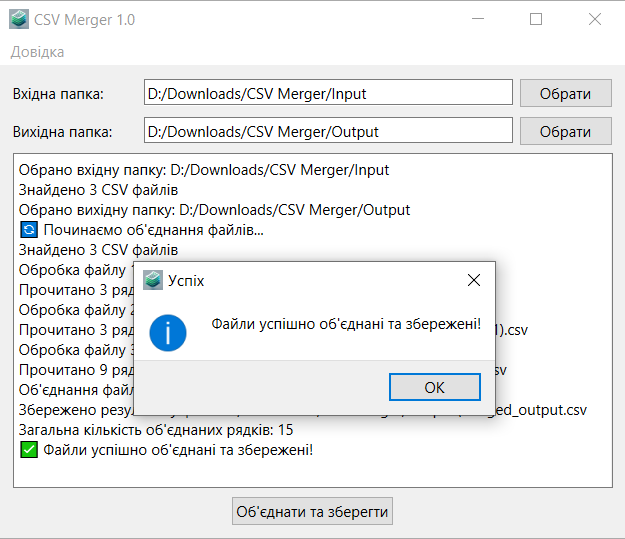

<h1 align="center">CSV Merger</h1>

  
  
  
   
  
  
  
  

---

  

## Опис

Легке і просте у використанні рішення для працівників освітніх закладів, які працюють з даними ЄДЕБО. Наша програма дозволяє ефективно об'єднувати та обробляти CSV-файли з конфіденційною інформацією, забезпечуючи максимальний захист даних.
  

**Ключові переваги:**
- Повністю автономна робота на вашому комп'ютері без передачі даних через інтернет
- Миттєве об'єднання файлів без втрати інформації
- Відповідність вимогам захисту персональних даних
- Зручний інтерфейс, розроблений спеціально для роботи з файлами ЄДЕБО
- Економія часу на рутинних операціях з даними

Розроблено спеціально для освітян України, з урахуванням усіх особливостей роботи з ЄДЕБО та вимог до захисту конфіденційної інформації.
Спростіть свою роботу з даними ЄДЕБО, зберігаючи максимальний рівень безпеки!
  

---

### Завантажити CSV Merger
<!-- BEGIN LATEST DOWNLOAD BUTTON -->

<!-- END LATEST DOWNLOAD BUTTON -->

---
## 🎈 Використання

---

  

---

Для використання програми достатньо обрати папку, де зберігаються файли, які треба об'єднати, а також вихідну папку, в якій буде збережений результат.